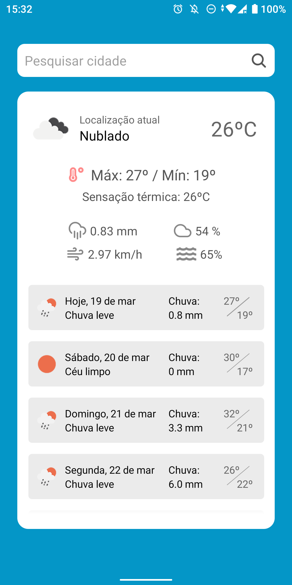
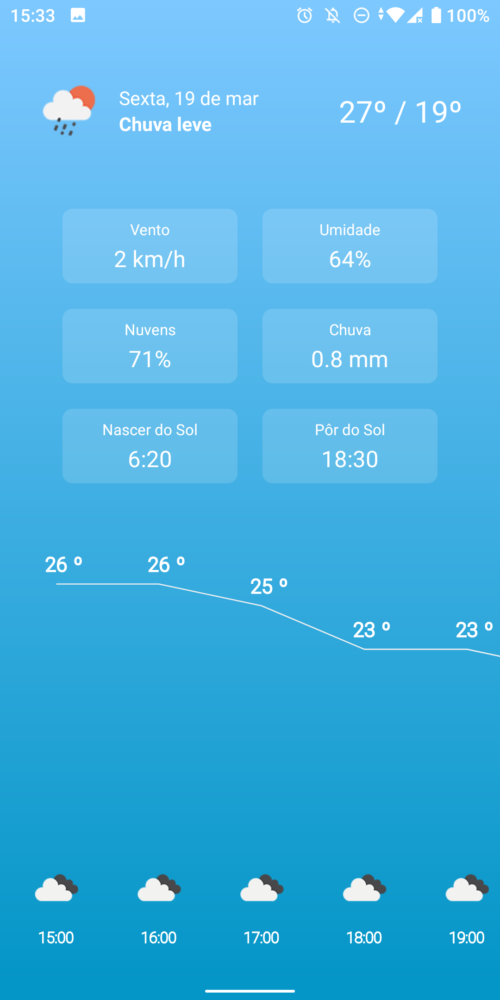
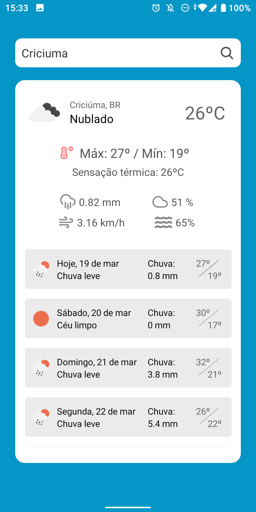

# Weather App 2.0

Aplicativo completo de previsão do tempo feito em React Native utilizando a API OpenWheatherMaps.

_Versão refatorada usando Expo e TypeScript_

### Principais features
* Previsão por geolocalização
* Previsão por pesquisa de cidades
* Informações sobre o clima atual
* Previsão diária de 7 dias
* Previsão horária para os dois primeiros dias

### Screenshots

<div>
    
    
    
</div>

### Como usar

Para instalar aplicativo final no android baixe o Apk para android na página de releases

##### Para rodar o projeto localmente:
É necessário ter instalado o expo-cli em seu computador, assim com o NodeJs versão 12 ou superior e o NPM ou Yarn.

Depois de baixar o código fonte, execute no teminal na pasta do projeto o seguinte comando pra instalar as bibliotecas necessárias:

```bash
npm install
# ou
yarn install
```

Com as bibliotecas necessárias, basta executar:
```bash
npm start
# ou
yarn start
```

Após isso, você poderá através do Expo Developer Tools, que abrirá em seu navegador, rodar o aplicativo em um emulador, ou até mesmo no celular, escaneando o QR Code com o aplicativo do Expo Go.
